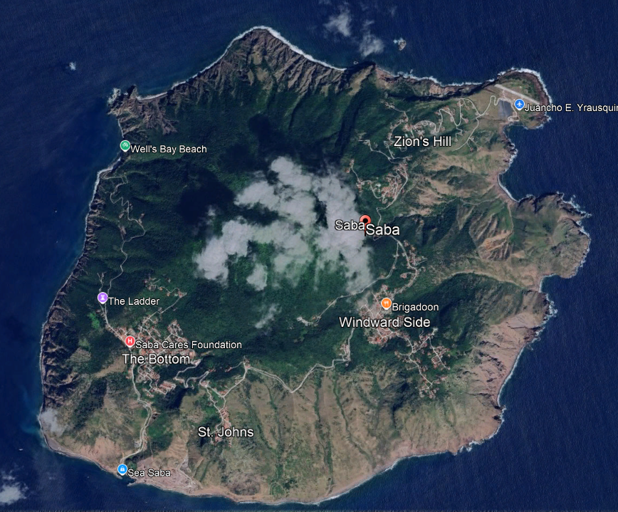

# Terrain: Saba

Saba is a small, steep volcanic island in the Caribbean. It rises from the sea to about 870 m within a few kilometres, so the elevation, the
slope and aspect and the horizon vary a great deal over short distances. This tutorial calculates the clear-sky radiation for every cell
of a 5 m digital elevation model of the island, at 17.6°N. The elevation gives the pressure and the elevation correction of the atmosphere,
the slope and aspect give the angle of the surface to the sun, the horizon angles give the shade of the mountain and its ridges, and the aerosols
set the optical depth.

The terrain is derived with [Geomorphometry.jl](https://github.com/Deltares/Geomorphometry.jl) (Pronk 2026), which also uses Saba as an example, 
and the aerosols are those of the [Global Aerosol Data Set](../manual/aerosols.md#The-Global-Aerosol-Data-Set) (GADS).

## Setup

```julia
using Pkg
Pkg.add(["Unitful", "Rasters", "RasterDataSources", "ArchGDAL", "NCDatasets", "Geomorphometry", "CairoMakie"])
Pkg.add(url = "https://github.com/BiophysicalEcology/SolarRadiation.jl")
Pkg.add(url = "https://github.com/BiophysicalEcology/FluidProperties.jl")
```

Data are downloaded to the folder in the environment variable RASTERDATASOURCES_PATH:

```julia
ENV["RASTERDATASOURCES_PATH"] = joinpath(homedir(), "RasterDataSources") # or "/your/path/here"
```

## The elevation data

The elevation model is the one used in the documentation of [Geomorphometry.jl](https://github.com/Deltares/Geomorphometry.jl). It is made from airborne LiDAR of Saba, resampled from
0.5 m to 5 m, and is downloaded from a release of that package. Its cells are in metres in a local coordinate system without a location,
so the position of the island is given here. The elevation of the sea is missing, and it is set to zero.

```@example saba
using Downloads, Rasters, ArchGDAL, NCDatasets, RasterDataSources, Geomorphometry
using Geomorphometry: Horn
using SolarRadiation, FluidProperties, Unitful
using CairoMakie

data_dir = mkpath(joinpath(ENV["RASTERDATASOURCES_PATH"], "saba"))
file = joinpath(data_dir, "saba.tif")
isfile(file) || Downloads.download("https://github.com/Deltares/Geomorphometry.jl/releases/download/v0.6.0/saba.tif", file)

latitude, longitude = 17.63, -63.23 # degrees, of the island

dtm = Raster(file)
size(dtm)
```

[Geomorphometry.jl](https://github.com/Deltares/Geomorphometry.jl) works on the matrix of the raster, with the first index running east and the second north. The Saba raster has north first, so it is reversed:

```@example saba
land = reverse(.!ismissing.(dtm); dims = Y)
dem = Float32.(reverse(coalesce.(dtm, 0.0f0); dims = Y))

# the smallest area of cells that has all of the land
xs = findall(vec(any(parent(land); dims = 2)))
ys = findall(vec(any(parent(land); dims = 1)))
ix, iy = first(xs):last(xs), first(ys):last(ys)

onland(x) = Raster(ifelse.(parent(land), Float32.(parent(x)), NaN32), dims(dem)) # NaN in the sea
cell_size = Geomorphometry.cellsize(dem)
elevation_of_land = parent(dem)[parent(land)]
(cell_size_m = cell_size, land_cells = length(elevation_of_land), elevation_m = extrema(elevation_of_land))
```

## Slope, aspect and horizon angles

The slope is the angle of the surface from the horizontal, and the aspect is the direction it faces, in degrees clockwise from north. Both are
found from the elevation of the eight neighbouring cells (Horn 1981). The horizon angle in a direction is the greatest angle to the
sky of the terrain along that direction. We calculate 32 directions, 11.25° apart. The directions of Geomorphometry.jl start at the
north of the matrix, which for this layout points west, so they are shifted a quarter of a turn to make the first direction north, as
[`SolarTerrain`](@ref) needs.

```@example saba
directions = 32

slope = Geomorphometry.slope(dem; method = Horn(), cellsize = cell_size)
aspect = Geomorphometry.aspect(dem; method = Horn(), cellsize = cell_size)
horizon = circshift(Geomorphometry.horizon_angle(parent(dem); directions, cellsize = cell_size), (0, 0, -directions ÷ 4))
size(horizon)
```

The elevation, slope and aspect of the island:

```@example saba
f = Figure(size = (520, 1050))
for (row, (title, field, colormap)) in enumerate((
        ("Elevation (m)", dem, :viridis),
        ("Slope (°)", slope, :viridis),
        ("Aspect (° clockwise from north)", aspect, :twilight)))
    ax = Axis(f[row, 1]; title, aspect = DataAspect(), xlabel = "Easting (m)", ylabel = "Northing (m)")
    hm = heatmap!(ax, onland(field)[X(ix), Y(iy)]; colormap, nan_color = :gray90)
    Colorbar(f[row, 2], hm)
end
f
```

The slopes are steepest on the flanks of the mountain, which faces every direction, and the aspect goes round the compass from
its summit.

## Aerosols from GADS

The optical depth of the aerosols is that of the GADS cell of the island, at 50 % relative humidity, with the summer profile for the
June solstice and the winter profile for the December solstice, interpolated to the wavelengths of the model
(see [Aerosols](../manual/aerosols.md) for how this is done):

```@example saba
gads = read(Raster(getraster(GADS); name = :OPTDEPTH))
model_wavelengths = SolarProblem().wavelengths
gads_wavelengths = collect(lookup(gads, :wavelength)) .* u"nm"

function interpolate_linear(x, y, xnew)
    map(xnew) do q
        q <= first(x) && return first(y)
        q >= last(x) && return last(y)
        k = searchsortedlast(x, q)
        t = (q - x[k]) / (x[k+1] - x[k])
        (1 - t) * y[k] + t * y[k+1]
    end
end

aerosols(season) = max.(interpolate_linear(gads_wavelengths,
    Float64.(collect(gads[X(Near(longitude)), Y(Near(latitude)), relhum = Near(50.0), season = At(season)])), model_wavelengths), 0.0)

june = SolarProblem(; aerosol_optical_depth = aerosols(0.0))
december = SolarProblem(; aerosol_optical_depth = aerosols(1.0))
nothing # hide
```

## Radiation for every cell

For each land cell we make a [`SolarTerrain`](@ref) with its elevation, slope, aspect and vector of horizon angles, and
calculate a day of hourly clear-sky radiation with [`solar_radiation!`](@ref), reusing the arrays for every cell. The pressure comes from the elevation
with `atmospheric_pressure` of [FluidProperties.jl](https://github.com/BiophysicalEcology/FluidProperties.jl). The default [`DaveFurukawaScattering`](@ref) diffuse model is used because it is fast. With it the radiation is
the direct beam and the ultraviolet diffuse radiation, which is where the effects of the terrain are, although the diffuse radiation of the whole sky is
not included (this can be done with the far more computationally intensive [`ChandrasekharScattering`](@ref)).

The calculation is made for every fourth cell in each direction, cells 20 m apart. The horizon can be turned off, to show its effect.

```@example saba
hours = collect(0.0:1.0:23.0)
nmax = SolarProblem().wavelength_count
out = allocate_output_arrays(length(hours), 1, nmax)
buffers = allocate_buffers(nmax, DaveFurukawaScattering())

cells_x, cells_y = ix[1:4:end], iy[1:4:end]

function hourly_radiation(problem, day; use_horizon = true)
    result = fill(NaN * u"W/m^2", length(cells_x), length(cells_y), length(hours))
    for (b, j) in enumerate(cells_y), (a, i) in enumerate(cells_x)
        land[i, j] || continue
        height = Float64(dem[i, j]) * u"m"
        cell_aspect = aspect[i, j]
        terrain = SolarTerrain(;
            elevation = height, albedo = 0.2, latitude = latitude * u"°", longitude = longitude * u"°",
            horizon_angles = use_horizon ? Float64.(horizon[i, j, :]) .* u"°" : fill(0.0u"°", directions),
            slope = Float64(slope[i, j]) * u"°",
            aspect = isnan(cell_aspect) ? 0.0u"°" : Float64(cell_aspect) * u"°",
            atmospheric_pressure = atmospheric_pressure(height),
        )
        solar_radiation!(out, buffers, problem; solar_terrain = terrain, days = [float(day)], hours)
        result[a, b, :] = out.global_terrain # at each hour
    end
    result
end

cell_dims = (X(lookup(dem, X)[cells_x]), Y(lookup(dem, Y)[cells_y]))
at_hour(radiation, hour) = Raster(ustrip.(radiation[:, :, findfirst(==(float(hour)), hours)]), cell_dims)
daily(radiation) = Raster(ustrip.(uconvert.(u"MJ/m^2", dropdims(sum(radiation; dims = 3); dims = 3) .* 1.0u"hr")), cell_dims) # per day

june_solstice, december_solstice = 172, 355
hourly_radiation(june, june_solstice) # compile
seconds = @elapsed june_hourly = hourly_radiation(june, june_solstice)
december_hourly = hourly_radiation(december, december_solstice)
nothing # hide
```

This code plots the daily radiation on the solstices:

```@example saba
f = Figure(size = (520, 720))
for (row, (title, radiation)) in enumerate((
        ("Global irradiance, June solstice (MJ m⁻² day⁻¹)", june_hourly),
        ("Global irradiance, December solstice (MJ m⁻² day⁻¹)", december_hourly)))
    ax = Axis(f[row, 1]; title, aspect = DataAspect(), xlabel = "Easting (m)", ylabel = "Northing (m)")
    hm = heatmap!(ax, daily(radiation); nan_color = :gray90)
    Colorbar(f[row, 2], hm)
end
f
```

## Vegetation

The elevation model is of the bare ground, so the radiation above is for the ground surface without the shade of vegetation. The cover of vegetation
can be seen from the surface model of the same release, which includes the tops of trees and buildings. The height of the canopy is the surface model minus
the terrain model. Cells with a canopy lower than 2 m are taken as bare ground or low vegetation, and are one colour, and above that the height is shown from 2 m to 25 m.

A satellite image of the island, for comparison. The dark green of the forest is on the interior and the upper slopes, and the brown of the bare and dry ground on the lower flanks
and the coast. The image is not georeferenced, but it is oriented with north at the top, like the maps here.



Image: Google Earth. Imagery providers are credited in the capture of the source image.

The radiation over a whole year is found from every fifteenth day, each of which stands for the days around it. The aerosols of July are used from April to September, and those of January
for the other months:

```@example saba
sampled_days = 8:15:353
annual = zeros(length(cells_x), length(cells_y))
for day in sampled_days
    problem = 91 <= day <= 273 ? june : december
    annual .+= parent(daily(hourly_radiation(problem, day)))
end
annual .*= 365 / length(sampled_days) # MJ m⁻² year⁻¹
nothing # hide
```

The canopy and the radiation over the year:

```@example saba
dsm_file = joinpath(data_dir, "saba_dsm.tif")
isfile(dsm_file) || Downloads.download("https://github.com/Deltares/Geomorphometry.jl/releases/download/v0.6.0/saba_dsm.tif", dsm_file)
surface = Float32.(reverse(coalesce.(Raster(dsm_file), NaN32); dims = Y))

bare_threshold = 2.0f0 # m
canopy = Raster(ifelse.(parent(land) .& .!isnan.(parent(surface)), clamp.(parent(surface) .- parent(dem), 0.0f0, 30.0f0), NaN32), dims(dem))

f = Figure(size = (520, 720))
ax1 = Axis(f[1, 1]; title = "Height of the canopy (m)", aspect = DataAspect(), xlabel = "Easting (m)", ylabel = "Northing (m)")
hm1 = heatmap!(ax1, canopy[X(ix), Y(iy)]; colorrange = (bare_threshold, 25.0f0), colormap = :Greens, lowclip = :wheat, nan_color = :gray90)
Colorbar(f[1, 2], hm1)
ax2 = Axis(f[2, 1]; title = "Global irradiance over a year (MJ m⁻²)", aspect = DataAspect(), xlabel = "Easting (m)", ylabel = "Northing (m)")
hm2 = heatmap!(ax2, Raster(annual, cell_dims); nan_color = :gray90)
Colorbar(f[2, 2], hm2)
f
```

The tall canopy covers the interior and the upper slopes, and the bare or low cover is on the lower flanks and the coast, while the radiation changes at a finer scale, with the aspect and the shade of the ridges.
Cell by cell the two do not have a strong relationship. The radiation here is the clear-sky radiation of the ground surface, and the vegetation also depends on the depth of the soil, on the cloud
and the rain, and on the clearing of the land, which are not in the model.

## Through the day

The shade of the mountain changes with the sun. At this latitude the sun at noon on the December solstice is 41° from the vertical, in the south, and
at the June solstice it is 6° from the vertical, in the north. The next code block plots the global irradiance on the December solstice, at four times of the day:

```@example saba
times = (8, 10, 12, 16)
f = Figure(size = (850, 700))
for (k, hour) in enumerate(times)
    ax = Axis(f[div(k - 1, 2) + 1, mod(k - 1, 2) + 1]; title = "$(hour):00 solar time", aspect = DataAspect())
    hm = heatmap!(ax, at_hour(december_hourly, hour); colorrange = (0, 600), nan_color = :gray90)
    k == length(times) && Colorbar(f[1:2, 3], hm; label = "W m⁻²")
end
f
```

In the morning the sun is in the east and the eastern slopes are lit, with the western slopes in the shade of the summit, and in the
afternoon it is the other way round. At noon the low sun in the south lights the southern slopes and leaves the northern slopes in the shade. The daily
total, the integral of the hourly radiation, is the map above.

## The effect of the horizon

The horizon angles give the shade that the summit and the ridges cast on the slopes behind them. The daily radiation on the December solstice
without the horizon angles and with them, with the elevation, slope and aspect in both:

```@example saba
without_horizon = daily(hourly_radiation(december, december_solstice; use_horizon = false))
with_horizon = daily(december_hourly)

f = Figure(size = (520, 720))
for (row, (title, radiation)) in enumerate(("without the horizon" => without_horizon, "with the horizon" => with_horizon))
    ax = Axis(f[row, 1]; title, aspect = DataAspect(), xlabel = "Easting (m)", ylabel = "Northing (m)")
    hm = heatmap!(ax, radiation; colorrange = (0, 25), nan_color = :gray90)
    row == 2 && Colorbar(f[1:2, 2], hm; label = "MJ m⁻² day⁻¹")
end
f
```

The mean, minimum and maximum of the daily radiation of the cells, for both solstices:

```@example saba
june_without_horizon = daily(hourly_radiation(june, june_solstice; use_horizon = false))

function radiation_statistics(name, radiation)
    v = filter(!isnan, radiation)
    (case = name, mean = round(sum(v) / length(v); digits = 2), minimum = round(minimum(v); digits = 2), maximum = round(maximum(v); digits = 2))
end

[radiation_statistics("December, without the horizon", without_horizon),
    radiation_statistics("December, with the horizon", with_horizon),
    radiation_statistics("June, without the horizon", june_without_horizon),
    radiation_statistics("June, with the horizon", daily(june_hourly))]
```

The horizon removes the direct beam where the summit and the ridges hide the sun, and does not change the cells with an open horizon. It lowers the
mean radiation of the island by 6 % at the December solstice, when the sun is low, and by 3 % at the June solstice.

## Speed

The terrain of the whole area, and the radiation for each of the cells, were calculated quickly enough for a laptop:

```@example saba
cells = length(dem)
slope_seconds = @elapsed Geomorphometry.slope(dem; method = Horn(), cellsize = cell_size)
aspect_seconds = @elapsed Geomorphometry.aspect(dem; method = Horn(), cellsize = cell_size)
horizon_seconds = @elapsed Geomorphometry.horizon_angle(parent(dem); directions, cellsize = cell_size)
solar_cells = count(parent(land)[cells_x, cells_y])

[(step = "slope", cells = cells, seconds = round(slope_seconds; sigdigits = 2), microseconds_per_cell = round(1e6 * slope_seconds / cells; sigdigits = 2)),
    (step = "aspect", cells = cells, seconds = round(aspect_seconds; sigdigits = 2), microseconds_per_cell = round(1e6 * aspect_seconds / cells; sigdigits = 2)),
    (step = "horizon angles, $directions directions", cells = cells, seconds = round(horizon_seconds; sigdigits = 2), microseconds_per_cell = round(1e6 * horizon_seconds / cells; sigdigits = 2)),
    (step = "radiation for a day, hourly", cells = solar_cells, seconds = round(seconds; sigdigits = 2), microseconds_per_cell = round(1e6 * seconds / solar_cells; sigdigits = 2))]
```

The radiation for a day is a calculation at 24 times and 111 wavelengths for each cell. It is proportional to the number of cells and times, and with
[`ChandrasekharScattering`](@ref) it would be more than a thousand times longer (see [Diffuse models](../manual/diffuse_models.md)).

## References

Horn BKP (1981) Hill shading and the reflectance map. Proceedings of the IEEE 69: 14-47.

Pronk M (2026) Geomorphometry.jl. Zenodo. [doi:10.5281/zenodo.18851928](https://doi.org/10.5281/zenodo.18851928)
